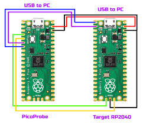
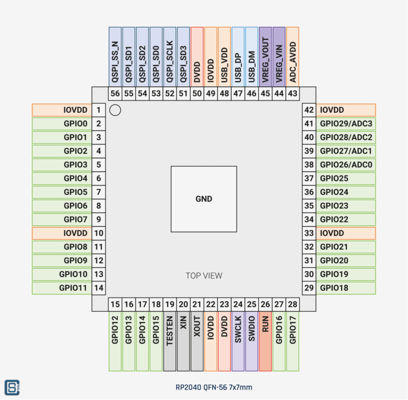
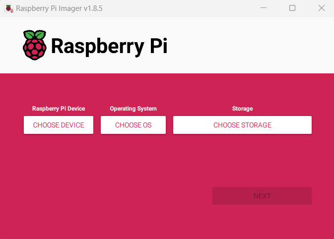
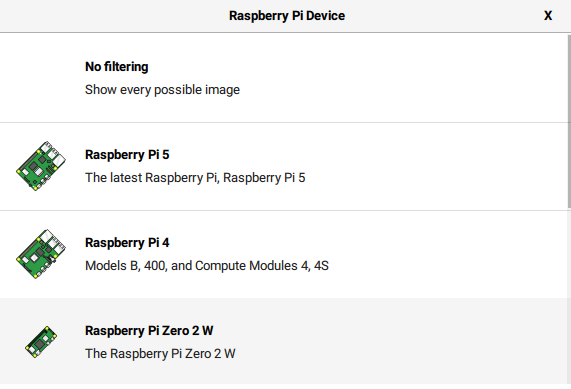
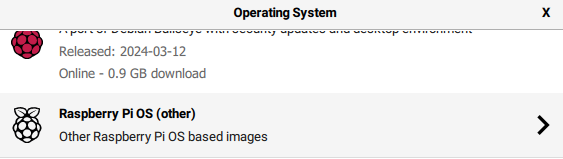
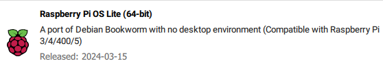
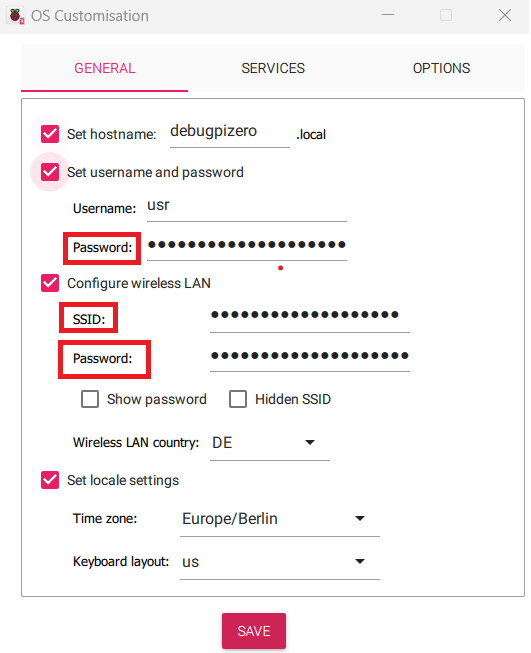
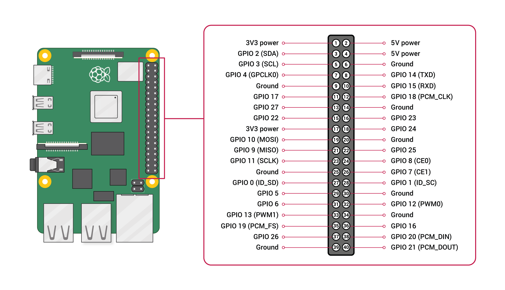
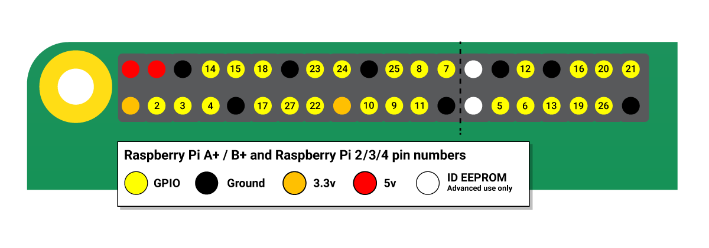

# Rp2040-DebuggerSetup

**_NOTE:_**  This is not meant to replace the official [Pico Getting Started Guide](https://datasheets.raspberrypi.com/pico/getting-started-with-pico.pdf).

This manual will contain my personal setup process and I can not promise yours is gone be the same.
It has been done on a Ubuntu/Debian based Linux environment.

If you are on Windows you will be able to use it in your Ubuntu/Debian based WSL. 

[](https://learn.microsoft.com/en-us/windows/wsl/install)

On WSL you might also want to checkout ([usbipd](https://learn.microsoft.com/en-us/windows/wsl/connect-usb)) or the ([openosd server configuration](https://openocd.org/doc/html/Server-Configuration.html)) if you like to attach your RP2040 to a remote debugging device.

Links:

[Raspberry Pi Debug Probe product page](https://www.raspberrypi.com/products/debug-probe/)

[Raspberry Pi Pico product page](https://www.raspberrypi.com/products/raspberry-pi-pico/)

[Pico Getting Started Guide](https://datasheets.raspberrypi.com/pico/getting-started-with-pico.pdf)

[Pico Probe firmware](https://github.com/raspberrypi/debugprobe/releases/tag/debugprobe-v2.0.1)

## Setup your RP2040 Debug Probe

There is a official ([debug probe](https://www.raspberrypi.com/products/debug-probe/)) if you have one or you already know how to 
debug your device skip this section.

The most cost effective way will be to use to RP2040 devices. To make a debug probe out of one download a "debugprobe_on_pico.uf2"
from the official ([Raspberry Pi debugprobe](https://github.com/raspberrypi/debugprobe/releases/) repository.
Take the device you want to use as probe hold down the boot button and connect it to your pc.
Coppy the "debugprobe_on_pico.uf2" to the mounted device and give it a few seconds to restart.

Run "lsusb" and check for your device:

```shell
usr@system~ $ lsusb |grep DAP
Bus 001 Device 002: ID 2e8a:000c Raspberry Pi Debugprobe on Pico (CMSIS-DAP)
```

Remember the ID ( here 2e8a:000c where "000C" is the product ID and 2e8a is the vendor ID).
Then create a udev rule so that you will be able to use the device without sudo.

Then use a text editor of your choice and create a new rule file in "/etc/udev/rules.d/"
I'm gone use nano but it should work with any.

```shell
usr@system~ $ sudo nano /etc/udev/rules.d/46-probe.rules
```

Add the these two lines with your product an vendor id (should be the same then mine except someone changed it in the probe repository):

```shell
# USB debug probe
ATTRS{idProduct}=="000c", ATTRS{idVendor}=="2e8a", MODE="666", GROUP="plugdev"
```

Store and close the file. You will need to reload the udev rules or restart your system (I recommend just reloading them it's faster).

```shell
usr@system~ $ sudo udevadm control --reload-rules
usr@system~ $ sudo udevadm trigger
```

Your Probe is ready to use.
[]()

|GP2   | SWCLK|
|GP3   | SWDIO|
|GND   | GND  |

You do not need to use the other connections.

### Compile and install openOCD

You might also want to use a homebrew openOCD, because some clone RP2040 devices might not be supported out of the box. More to that in the [clone device section](### Clone devices)

```shell
usr@system~/pico/ $ git clone https://github.com/raspberrypi/openocd.git
usr@system~/pico/ $ cd openocd
usr@system~/pico/openocd/ $ ./bootstrap
usr@system~/pico/openocd/ $ ./configure --enable-cmsis-dap
```
check the summary

```shell
OpenOCD configuration summary
--------------------------------------------------
MPSSE mode of FTDI based devices        yes (auto)
ST-Link Programmer                      yes (auto)
TI ICDI JTAG Programmer                 yes (auto)
Keil ULINK JTAG Programmer              yes (auto)
Altera USB-Blaster II Compatible        yes (auto)
Bitbang mode of FT232R based devices    yes (auto)
Versaloon-Link JTAG Programmer          yes (auto)
TI XDS110 Debug Probe                   yes (auto)
CMSIS-DAP v2 Compliant Debugger         yes (auto)
OSBDM (JTAG only) Programmer            yes (auto)
eStick/opendous JTAG Programmer         yes (auto)
Olimex ARM-JTAG-EW Programmer           yes (auto)
Raisonance RLink JTAG Programmer        yes (auto)
USBProg JTAG Programmer                 yes (auto)
Espressif JTAG Programmer               yes (auto)
Andes JTAG Programmer (deprecated)      no
CMSIS-DAP Compliant Debugger            yes
Nu-Link Programmer                      yes (auto)
Cypress KitProg Programmer              yes (auto)
Altera USB-Blaster Compatible           yes (auto)
ASIX Presto Adapter                     yes (auto)
OpenJTAG Adapter                        yes (auto)
Linux GPIO bitbang through libgpiod     no
SEGGER J-Link Programmer                yes (auto)
Bus Pirate                              yes (auto)
Use Capstone disassembly framework      no
```

"CMSIS-DAP Compliant Debugger" needs to be enabled if it did'nt work check the dependencies above and install missing packages
with your packet manager. then run the configure command again. If everything is right you can make and install openocd.

```shell
usr@system~/pico/openocd/ $ make
usr@system~/pico/openocd/ $ sudo make install
```

check if openocd is working

```shell
usr@system~/pico/openocd/ $ openocd -v
Open On-Chip Debugger 0.12.0-g4d87f6dca-dirty (2024-03-01-19:04)
Licensed under GNU GPL v2
For bug reports, read
        http://openocd.org/doc/doxygen/bugs.html
usr@system~/pico/openocd/ $ openocd -f interface/cmsis-dap.cfg -f target/rp2040.cfg
```
The Output should look like this:
```shell
Open On-Chip Debugger 0.12.0-g4d87f6dca-dirty (2024-06-01-19:04)
Licensed under GNU GPL v2
For bug reports, read
        http://openocd.org/doc/doxygen/bugs.html
adapter speed: 5000 kHz

Info : Hardware thread awareness created
Info : Hardware thread awareness created
Info : Listening on port 6666 for tcl connections
Info : Listening on port 4444 for telnet connections
Info : Using CMSIS-DAPv2 interface with VID:PID=0x2e8a:0x000c, serial=0990752304241816
Info : CMSIS-DAP: SWD supported
Info : CMSIS-DAP: Atomic commands supported
Info : CMSIS-DAP: Test domain timer supported
Info : CMSIS-DAP: FW Version = 2.0.0
Info : CMSIS-DAP: Interface Initialised (SWD)
Info : SWCLK/TCK = 0 SWDIO/TMS = 0 TDI = 0 TDO = 0 nTRST = 0 nRESET = 0
Info : CMSIS-DAP: Interface ready
Info : clock speed 5000 kHz
Info : SWD DPIDR 0x0bc12477, DLPIDR 0x00000001
Info : SWD DPIDR 0x0bc12477, DLPIDR 0x10000001
Info : [rp2040.core0] Cortex-M0+ r0p1 processor detected
Info : [rp2040.core0] target has 4 breakpoints, 2 watchpoints
Info : [rp2040.core1] Cortex-M0+ r0p1 processor detected
Info : [rp2040.core1] target has 4 breakpoints, 2 watchpoints
Info : starting gdb server for rp2040.core0 on 3333
Info : Listening on port 3333 for gdb connections
```
If you get the "Error: Failed to connect multidrop rp2040.dap0" check your connections first, if that was not the problem go the the [clone device section](### Clone devices)

Thats it with the installation. Followup with my empty template.

### Clone devices

Some clone devices have a different pin out on the debug connector.
Check that there is a connection from your debug probe SWDIO to Pin25
and one from SWCLK to Pin24.

[]()


**_NOTE:_**  I had trouble getting a geeekPi to talk with the debugger, because the ground pin is not in the middle.

Some clones have a Flash chip that is not supported by openOCD. The default firmware will be able to use the chip 
but openOCD will complain about a unsupported chip ID. Open "openocd/src/flash/nor/spi.c" in your openOCD repro and 
add the following line. Then recompile openOCD and install (### Compile and install Open OCD).

**_NOTE:_**  0x001660ba is the chipID from the GeeekPi 4mb clone, on mine the manufacturer marking was removed with a grinder. I have not 
been able to figure out what SPI Flash chip is used... lesson learned -> don't by a cheep clone

```code

	FLASH_ID("win w25q16jv",        0x03, 0x00, 0x02, 0xd8, 0xc7, 0x001540ef, 0x100, 0x10000, 0x200000),
	FLASH_ID("win w25q16jv_CLONE",  0x03, 0x00, 0x02, 0xd8, 0xc7, 0x001660ba, 0x100, 0x10000, 0x200000), 

```

## How-To set up your PI for remote debugging

### Select a image

If you not already have, download and install the official ([Raspberry Pi Imager](https://www.raspberrypi.com/news/raspberry-pi-imager-imaging-utility/)).

[]()

Choose your device.

[]()

Select an operating system any will do, this manual is written and tested with Raspberry Pi OS Lite.
If you like to have a desktop pleas feel free to use any other version.

[]()

[]()

Before flashing the device make sure that you set up a user and configure all network devices that you need.

[]()

[]()

Then create your SD media. Insert it into your Pi and plug in the Power

### Setup the Remote debug environment

First step is to connect your terminal via ssh.

```shell
ssh usr@debugpizero.local
usr@debugpizero:~ $ sudo apt-get update
usr@debugpizero:~ $ sudo apt-get upgrade
usr@debugpizero:~ $ sudo apt-get -y install build-essential autoconf git pkg-config libtool libusb-1.0-0 libusb-1.0-0-dev texinfo 

```

#### setup openOCD

Short version, long version is in [Compile and install Open OCD](### Compile and install openOCD)
Except from the "./configure --enable-sysfsgpio --enable-bcm2835gpio" the setup process is the same.

```shell
usr@debugpizero:~ $ git clone https://git.code.sf.net/p/openocd/code openocd
usr@debugpizero:~ $ cd openocd
usr@debugpizero:~/openocd/ $ ./bootstrap
usr@debugpizero:~/openocd/ $ ./configure --enable-sysfsgpio --enable-bcm2835gpio
```
check the summary there should not be any missing packages then

```shell
usr@debugpizero:~/openocd/ $ make
usr@debugpizero:~/openocd/ $ sudo make install
```

openocd is now ready to go, but lets check the installation first

```shell
usr@debugpizero:~/openocd/ $ openocd -v
```

There is a predefined interface file available. If you want to use that one skip the next part and check the pin-out from
the official documentation.

### create custom config file

If you want to use custom pins you need to create your own interface config
therefor just create a .cfg file in the home directory. The benefit is that you can arrange the pins on your IO header
so that you are able to use a 1 to 1 cable.

let's create a custom interface config for SWD debugging on a RP2040 device

[]()

[]()

The RP2040 has the ground pin in the middle so we will be using the pins 22 and 18, because we don't want to fiddle with
3 single wires when attaching the device.

swdToRp2040.cfg:

```code
adapter driver bcm2835gpio
bcm2835gpio peripheral_base 0x20000000
# Transition delay calculation: SPEED_COEFF/khz - SPEED_OFFSET
# These depend on system clock, calibrated for stock 700MHz
# bcm2835gpio_speed SPEED_COEFF SPEED_OFFSET
bcm2835gpio speed_coeffs 113714 28
# Each of the SWD lines need a gpio number set: swclk swdio
# Header pin numbers: 22 18
adapter gpio swclk -chip 0 25
adapter gpio swdio -chip 0 24
transport select swd
bindto 0.0.0.0
```

That should do it for a RP2040. You can now start the server and connect your gdb.

```shell
usr@debugpizero:~/ $ openocd -f swdToRp2040.cfg -f  target/rp2040.cfg -c "adapter speed 5000"
```
